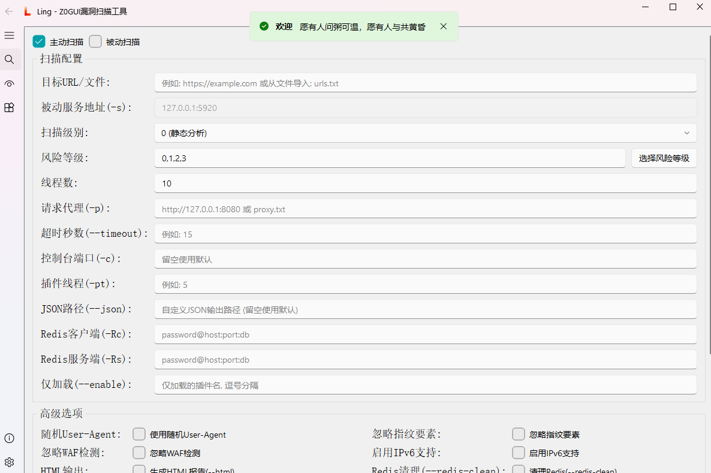
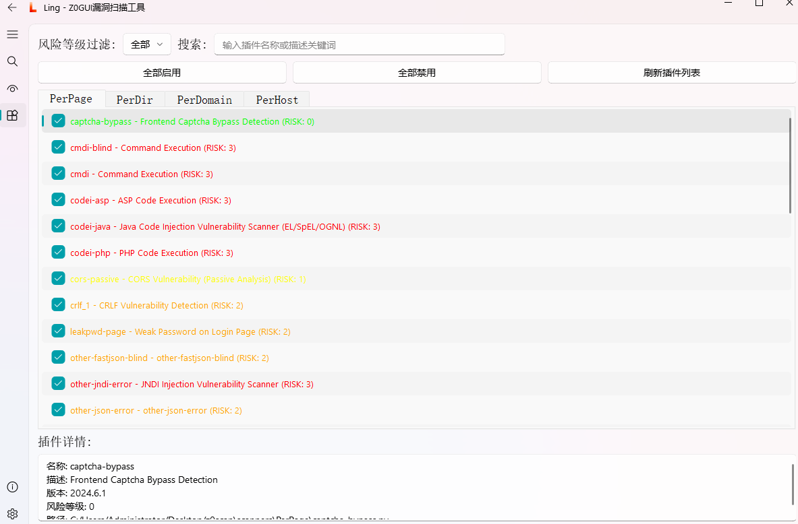
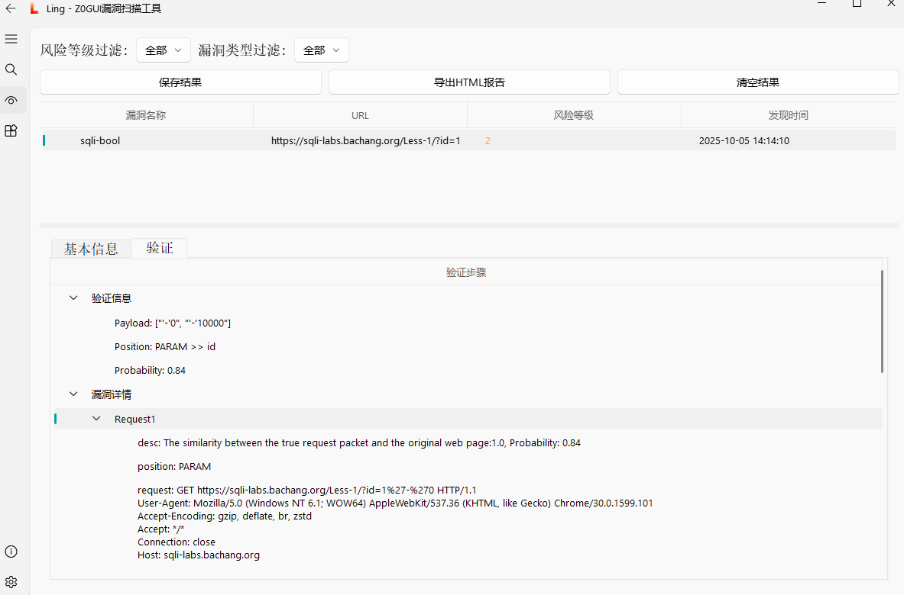

<h4 align="center" dir="auto">
  <a href="https://github.com/JiuZero/Ling/releases">发行版</a> •
  <a href="https://github.com/JiuZero/Ling/blob/master/doc/CHANGELOG.MD">更新日志</a>
</h4>

<p align="center">
  <a href="https://github.com/JiuZero/Ling/stargazers"></a>
  <a href="https://github.com/JiuZero/Ling/issues"></a>
  
  
  
</p>

---

## 🔗 联系

<table>
  <tr>
    <td width="25%" valign="top">
      <h3>公众号</h3>
      <ul>
        <li><b>90Safe</b></li>
      </ul>
    </td>
    <td width="25%" valign="top">
      <h3>微信</h3>
      <ul>
        <li><b>JiuZer1</b></li>
      </ul>
    </td>
    <td width="25%" valign="top">
      <h3>QQ</h3>
      <ul>
        <li><b>1703417187</b></li>
      </ul>
    </td>
    <td width="25%" valign="top">
      <h3>QQ交流群</h3>
      <ul>
        <li><b>1058256508</b></li>
      </ul>
    </td>
  </tr>
</table>

---

## ✨ 项目简介

Ling 是为 z0scan 而衍生的基于 PyQt5 与 QFluentWidgets 构建的图形化界面（GUI）

它提供直观易用的界面来驱动 z0scan 执行主动/被动扫描、插件启停、结果筛选与报告导出，适合希望以可视化方式快速开展 Web 安全测试的用户。

- 运行核心：通过命令行调用 z0scan
- UI 组件：PyQt5 + QFluentWidgets
- 主题支持：Light/Dark
- 报告支持：解析 z0 JSON报告并载入结果

> [!WARNING]
> Ling 不包含 z0scan 核心, 需本地存在可用的 z0 可执行文件或脚本。

---

## ✨ 核心特性

- 可视化操作
  - 主动扫描：输入单个 URL、或批量 URL 文件
  - 被动扫描：对接代理流量
  - 扫描参数：线程、级别、风险、超时、代理、仅加载/禁用插件等
- 插件管理
  - 自动读取 scanners 目录下 PerPage/PerDir/PerDomain/PerHost 四类插件
  - 支持按风险过滤、关键字搜索、一键启用/禁用
- 结果与报告
  - 风险、类型筛选与详情查看（验证步骤/细节树）
  - 保存 JSON 结果、导出 HTML 报告
- 主题与配置
  - Light/Dark 切换
  - 设置页可指定 z0 可执行路径、在线编辑 z0 的 config/config.py

---

## 📦 安装

请先准备 Python 3.8+ 环境

```bash
git clone https://github.com/JiuZero/Ling
cd Ling
pip install -r requirements.txt
python3 ling.py
```

---

## 🚀 快速开始

1) 准备 z0 可执行文件或脚本
- 推荐将 Ling 放至 z0scan 工作目录下
- 或在 Ling 设置页手动指定 z0 路径

2) 启动 GUI
```bash
python ling.py
```

---

## 🖼️ 截图

- 可视化主界面



- 插件管理



- 扫描结果



---

## ❓常见问题

- 无法找到 z0？
  - 将 z0.exe/z0/z0.py 放到 Ling 同目录，或在“设置”页指定 z0 路径
- 未显示插件列表？
  - 确认 scanners/PerPage|PerDir|PerDomain|PerHost 目录存在且含 .py 插件
- 扫描完成未载入结果？
  - 确保 z0 输出包含 “JSON Report Path: xxx.json”，并且该文件能被读取
  - 确保 z0 的扫描已结束（被动扫描需手动结束）

---

## 💖 Star 趋势

<p align="center">
  <a href="https://star-history.com/#JiuZero/Ling&Date">
    
  </a>
</p>